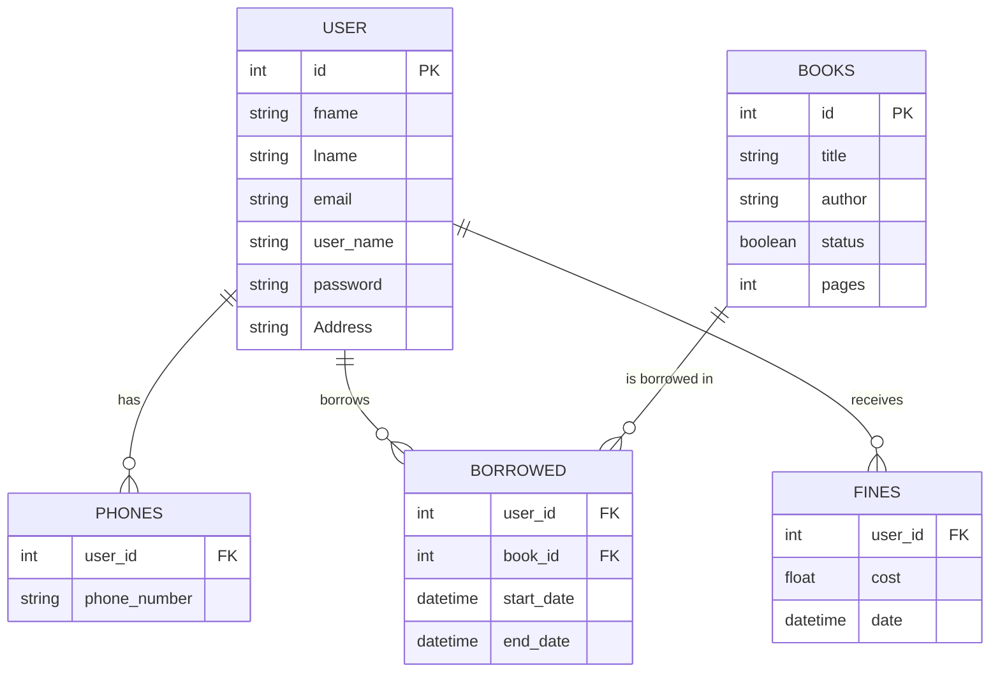

# Page Flow
<div align="center">
  
</div>

PageFlow – Smooth management of books and records.

## About the Project

# Library Management System
A Python-based library management system using Pygame for the GUI and MySQL for data storage.

## Table of Contents
- [Core Capabilities](#core-capabilities)
- [Key Features](#key-features)
- [Database Design](#database-design)
  - [ER Diagram](#er-diagram)
  - [Database Schema](#database-schema)
  - [Constraints](#constraints)
- [Installation & Setup](#Getting Started)
- [Usage](#usage)

## Core Capabilities
- User authentication and role-based access (Admin/User)
- Book management (add, remove, search, track)
- User management (registration, removal, search)
- Borrowing system with due dates
- Fine calculation for overdue books
- Real-time book availability tracking

## Key Features

### Admin Features
- Add new books to the library inventory
- Remove books from the system
- View all available books
- Search books by title
- View all registered users
- Remove users from the system
- Track borrowed books and return dates
- Monitor and manage fines
- Search for specific user details

### User Features
- Account creation and management
- Browse available books
- Borrow books with automated due dates
- Return borrowed books
- View personal borrowing history
- Receive notifications for overdue books
- Track personal fines

## Database Design

### ER Diagram

### Database Schema

#### User
```sql
CREATE TABLE user(
	id INT PRIMARY KEY auto_increment,
    fname varchar(50) NOT NULL, 
    lname varchar(50) NOT NULL,
    email varchar(50) NOT NULL,
    user_name varchar(50) UNIQUE NOT NULL,
    password varchar(50) NOT NULL 
);
```
#### books
```sql
CREATE TABLE books(
	id INT PRIMARY KEY auto_increment,
    title varchar(50) NOT NULL, 
    author varchar(50) NOT NULL,
    status boolean default false,
    pages smallint    
);
```
#### phones
```sql
CREATE TABLE phones(
	user_id INT , 
    phone_number VARCHAR(15),
    primary key (user_id , phone_number), 
    FOREIGN KEY (user_id) references user(id)
);
```
#### borrowed
```sql
CREATE TABLE borrowed(
	user_id INT , 
    book_id INT ,
    start_date TIMESTAMP DEFAULT CURRENT_TIMESTAMP , 
    end_date TIMESTAMP NOT NULL,
    primary key (user_id , book_id),
	FOREIGN KEY (user_id) references user(id),
    FOREIGN KEY (book_id) references books(id)
);
```
#### Fines
```sql
CREATE TABLE Fines(
	user_id INT ,
    cost INT ,
    Date timestamp default current_timestamp,
    primary key(user_id , Date)
);
```
### Constraints

- **Users must have unique usernames**
- **Books can only be borrowed if they are available (status = 1)**
- **Loan period is set to 10 days by default**
- **Late returns incur a fine of $5 per day**
- **Phone numbers must be either 11 digits or 13 digits (with country code)**
- **Email addresses must contain '@'**
- **Passwords must meet minimum security requirements**
- **Address must contain both numbers and text**
- **All core fields (username, password, name, email, address) are required**

## GUI

### Initial Page
First page offering login options for users or admins (admin credentials hardcoded)


### Admin Flow
1. Admin Login Screen


2. Admin Dashboard with Management Options


### User Flow
1. User Authentication Options


2. User Registration Form


3. User Login Screen


4. User Dashboard


## Features

- **User Management**: Role-based account control system
- **Book Inventory**: Complete book collection management
- **Borrowing System**: Book checkout and return tracking
- **Search Functionality**: Multi-filter search for books and users
- **Validation**: Comprehensive data integrity checks
- **Fine System**: Automated late return fee calculation

## Built With

- **Python**: Core programming language
- **MySQL**: Database management
- **Pygame**: GUI framework

## Getting Started

### Prerequisites

- Python 3.x ([Download](https://www.python.org/downloads/))
- Pygame module
- MySQL-connector
- Local [database setup](https://github.com/khalwsh/Library-Management-app/tree/main/database)

### Installation

1. Clone repository:
```bash
git clone https://github.com/khalwsh/Library-Management-app.git
cd Library-Management-app
python main.py
```
[demo](https://www.youtube.com/watch?v=0uzFFTsNlHk)
