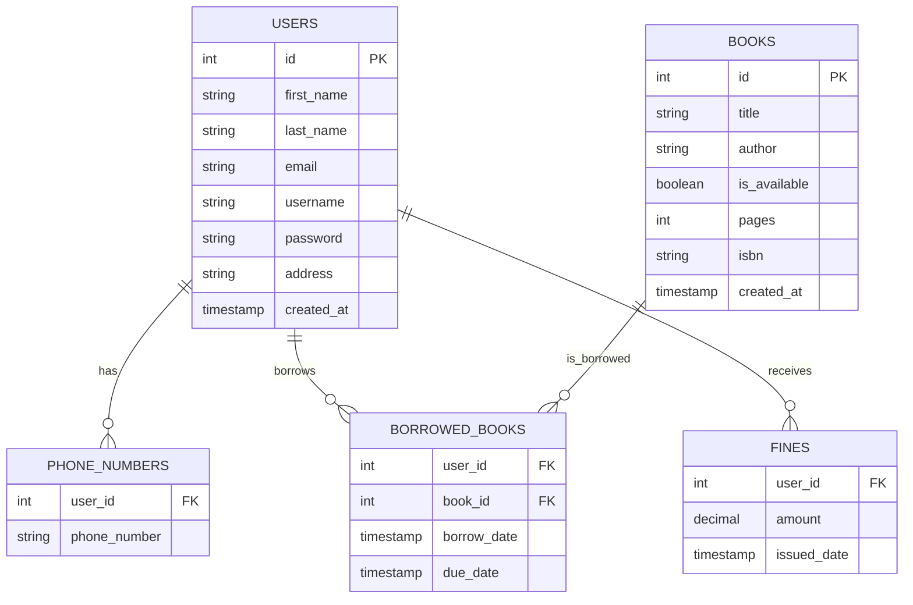

# PageFlow - Library Management System
<div align="center">
  
</div>

PageFlow – Smooth management of books and records.

## About the Project

Python-based library management system using Pygame and MySQL.

## Features

### Admin
- Book inventory management
- User administration 
- Borrowing oversight
- Fine management
- Search capabilities

### User
- Account management
- Book browsing/borrowing
- Return tracking
- Fine monitoring

## Database Schema

```sql
CREATE TABLE users (
    id INT PRIMARY KEY AUTO_INCREMENT,
    first_name VARCHAR(50) NOT NULL,
    last_name VARCHAR(50) NOT NULL,
    email VARCHAR(50) NOT NULL,
    username VARCHAR(50) UNIQUE NOT NULL,
    password VARCHAR(255) NOT NULL,
    address VARCHAR(100) NOT NULL,
    created_at TIMESTAMP DEFAULT CURRENT_TIMESTAMP,
    CONSTRAINT valid_email CHECK (email LIKE '%@%.%'),
    CONSTRAINT valid_address CHECK (
        address REGEXP '[0-9]' AND 
        address REGEXP '[a-zA-Z]'
    )
);

CREATE TABLE books (
    id INT PRIMARY KEY AUTO_INCREMENT,
    title VARCHAR(100) NOT NULL,
    author VARCHAR(100) NOT NULL,
    is_available BOOLEAN DEFAULT true,
    pages SMALLINT UNSIGNED,
    isbn VARCHAR(13) UNIQUE,
    created_at TIMESTAMP DEFAULT CURRENT_TIMESTAMP
);

CREATE TABLE phone_numbers (
    user_id INT,
    phone_number VARCHAR(15),
    PRIMARY KEY (user_id, phone_number),
    FOREIGN KEY (user_id) REFERENCES users(id) ON DELETE CASCADE,
    CONSTRAINT valid_phone CHECK (
        LENGTH(phone_number) IN (11, 13)
    )
);

CREATE TABLE borrowed_books (
    user_id INT,
    book_id INT,
    borrow_date TIMESTAMP DEFAULT CURRENT_TIMESTAMP,
    due_date TIMESTAMP NOT NULL,
    PRIMARY KEY (user_id, book_id),
    FOREIGN KEY (user_id) REFERENCES users(id),
    FOREIGN KEY (book_id) REFERENCES books(id),
    CONSTRAINT valid_due_date CHECK (
        due_date > borrow_date
    )
);

CREATE TABLE fines (
    user_id INT,
    amount DECIMAL(10,2) NOT NULL,
    issued_date TIMESTAMP DEFAULT CURRENT_TIMESTAMP,
    PRIMARY KEY (user_id, issued_date),
    FOREIGN KEY (user_id) REFERENCES users(id),
    CONSTRAINT valid_fine CHECK (amount > 0)
);
```

## ER Diagram



## Business Rules

- Unique usernames required
- Loan period: 10 days
- Late fee: $5/day
- Phone numbers: 11 or 13 digits
- Passwords must meet security requirements
- Required fields: username, password, name, email, address
### Constraints

- **Users must have unique usernames**
- **Books can only be borrowed if they are available (status = 1)**
- **Loan period is set to 10 days by default**
- **Late returns incur a fine of $5 per day**
- **Phone numbers must be either 11 digits or 13 digits (with country code)**
- **Email addresses must contain '@'**
- **Passwords must meet minimum security requirements**
- **Address must contain both numbers and text**
- **All core fields (username, password, name, email, address) are required**

## GUI

### Initial Page
First page offering login options for users or admins (admin credentials hardcoded)


### Admin Flow
1. Admin Login Screen


2. Admin Dashboard with Management Options


### User Flow
1. User Authentication Options


2. User Registration Form


3. User Login Screen


4. User Dashboard


## Features

- **User Management**: Role-based account control system
- **Book Inventory**: Complete book collection management
- **Borrowing System**: Book checkout and return tracking
- **Search Functionality**: Multi-filter search for books and users
- **Validation**: Comprehensive data integrity checks
- **Fine System**: Automated late return fee calculation

## Built With

- **Python**: Core programming language
- **MySQL**: Database management
- **Pygame**: GUI framework

## Getting Started

### Prerequisites

- Python 3.x ([Download](https://www.python.org/downloads/))
- Pygame module
- MySQL-connector
- Local [database setup](https://github.com/khalwsh/Library-Management-app/tree/main/database)

### Installation

1. Clone repository:
```bash
git clone https://github.com/khalwsh/Library-Management-app.git
cd Library-Management-app
python main.py
```
[demo](https://www.youtube.com/watch?v=0uzFFTsNlHk)
