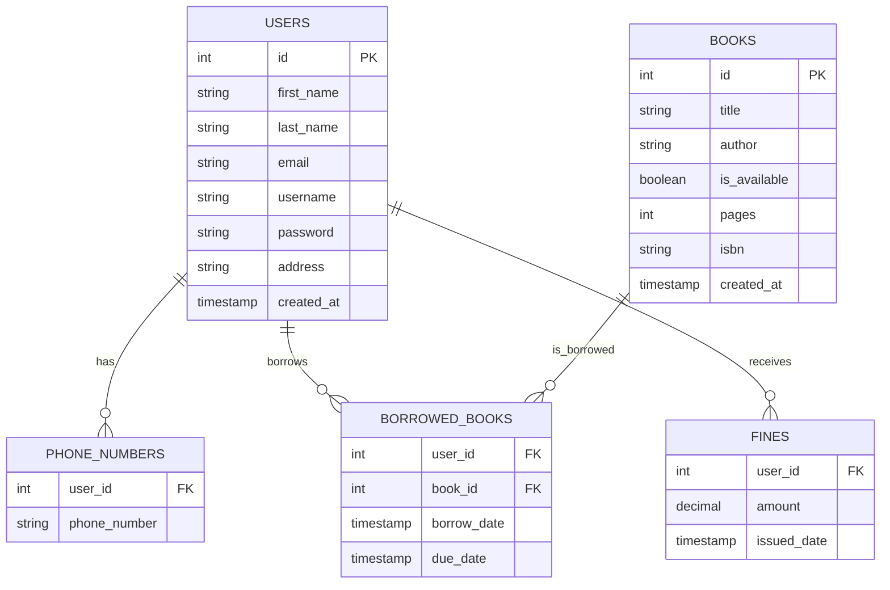

# PageFlow - Library Management System

<div align="center">
  
</div>

### PageFlow – Where Books Meet Efficiency

PageFlow is your ultimate solution for seamless library management, combining the power of Python, the versatility of MySQL, and the interactive capabilities of Pygame. With a user-centric design and robust features, it’s perfect for handling book collections, user accounts, and borrowing activities—all while ensuring data integrity and scalability.

PageFlow is a Python-based library management system designed for smooth management of books, users, and records. Whether you're an administrator or a bookworm, PageFlow has you covered!

### Key Technologies
- **Python**: Backend programming
- **MySQL**: Database management
- **Pygame**: GUI framework for an engaging user interface

### 🚀 Features
- **Book Inventory Management**: Add, update, or remove books with ease.
- **User Administration**: Manage user accounts and permissions.
- **Borrowing Oversight**: Monitor ongoing loans and returns.
- **Fine Management**: Automate fine calculations for late returns.
- **Advanced Search**: Find books and users with multi-criteria filters.
- **Account Management**: Create and manage user accounts.
- **Book Browsing & Borrowing**: Explore the catalog and borrow books.
- **Return Tracking**: Stay on top of return deadlines.
- **Fine Monitoring**: View and clear overdue fines.

---

### 📐 ER Diagram


## 🗄 Database Schema
```sql
CREATE TABLE users (
    id INT PRIMARY KEY AUTO_INCREMENT,
    first_name VARCHAR(50) NOT NULL,
    last_name VARCHAR(50) NOT NULL,
    email VARCHAR(50) NOT NULL,
    username VARCHAR(50) UNIQUE NOT NULL,
    password VARCHAR(255) NOT NULL,
    address VARCHAR(100) NOT NULL,
    created_at TIMESTAMP DEFAULT CURRENT_TIMESTAMP,
    CONSTRAINT valid_email CHECK (email LIKE '%@%.%'),
    CONSTRAINT valid_address CHECK (
        address REGEXP '[0-9]' AND 
        address REGEXP '[a-zA-Z]'
    )
);

CREATE TABLE books (
    id INT PRIMARY KEY AUTO_INCREMENT,
    title VARCHAR(100) NOT NULL,
    author VARCHAR(100) NOT NULL,
    is_available BOOLEAN DEFAULT true,
    pages SMALLINT UNSIGNED,
    isbn VARCHAR(13) UNIQUE,
    created_at TIMESTAMP DEFAULT CURRENT_TIMESTAMP
);

CREATE TABLE phone_numbers (
    user_id INT,
    phone_number VARCHAR(15),
    PRIMARY KEY (user_id, phone_number),
    FOREIGN KEY (user_id) REFERENCES users(id) ON DELETE CASCADE,
    CONSTRAINT valid_phone CHECK (
        LENGTH(phone_number) IN (11, 13)
    )
);

CREATE TABLE borrowed_books (
    user_id INT,
    book_id INT,
    borrow_date TIMESTAMP DEFAULT CURRENT_TIMESTAMP,
    due_date TIMESTAMP NOT NULL,
    PRIMARY KEY (user_id, book_id),
    FOREIGN KEY (user_id) REFERENCES users(id),
    FOREIGN KEY (book_id) REFERENCES books(id),
    CONSTRAINT valid_due_date CHECK (
        due_date > borrow_date
    )
);

CREATE TABLE fines (
    user_id INT,
    amount DECIMAL(10,2) NOT NULL,
    issued_date TIMESTAMP DEFAULT CURRENT_TIMESTAMP,
    PRIMARY KEY (user_id, issued_date),
    FOREIGN KEY (user_id) REFERENCES users(id),
    CONSTRAINT valid_fine CHECK (amount > 0)
);
```
## 🧠 Business Rules
- **Unique Usernames:** Every user must have a unique username.
- **Loan Period:** Books can be borrowed for 10 days.
- **Late Fee:** $5 per day for overdue returns.
- **Phone Numbers:** Must be 11 or 13 digits (with country code).
- **Secure Passwords:** Passwords must meet security standards.
- **Mandatory Fields:** Username, password, name, email, and address are required.

## 🎨 GUI Walkthrough


## 💻 Getting Started
### Prerequisites
- **Python 3.x** 
- **Pygame module**
- **MySQL Connector**
- **Local Database Setup**

### Installation

1. Clone repository:
```bash
git clone https://github.com/khalwsh/Library-Management-app.git
cd Library-Management-app
python main.py
```
[demo](https://www.youtube.com/watch?v=0uzFFTsNlHk)
